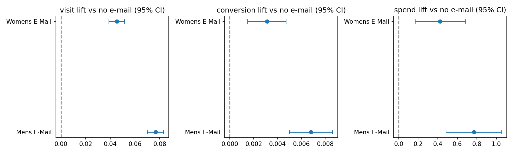
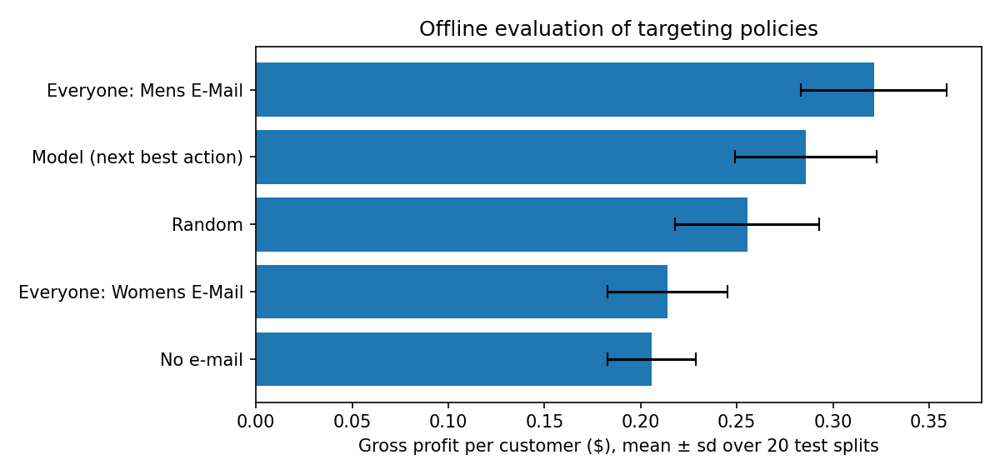
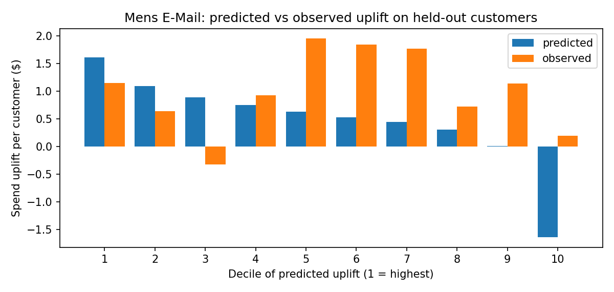

# Decision Intelligence Platform: E-mail Campaign Decisions

Takes a randomized marketing experiment from raw data to a business decision: checks that
the test is trustworthy, measures each campaign's lift with confidence intervals, tests
whether a next-best-action targeting model beats a simple blanket policy, and translates
the results into profit scenarios and an auto-generated executive summary.

**Data:** [MineThatData E-Mail Analytics Challenge](https://blog.minethatdata.com/2008/03/minethatdata-e-mail-analytics-and-data.html)
(Kevin Hillstrom, 2008): 64,000 real customers randomly split into three groups that
received a Mens e-mail, a Womens e-mail, or no e-mail, with visits, purchases, and spend
tracked for two weeks.

## Decision

**Send the Mens e-mail to everyone.** Do not deploy the targeting model.

| | |
|---|---|
| Mens e-mail | +$0.77 revenue per customer vs no e-mail (95% CI $0.48 to $1.05), a **118% lift** |
| Womens e-mail | +$0.42 per customer (95% CI $0.17 to $0.69) |
| Per 100,000 customers | Mens e-mail adds about **$77K revenue** and **$13K gross profit** (at 30% margin, $0.10/e-mail); profitable while e-mails cost under $0.23 |
| Targeting model | **11% less profit** than e-mailing everyone with the Mens campaign; beat it in only 1 of 20 test splits |

The full plain-language write-up is generated by the pipeline:
[reports/executive_summary.md](reports/executive_summary.md).

## 1. Is the experiment trustworthy?

- **Sample ratio check:** arm sizes (21,306 / 21,307 / 21,387) match an even split
  (chi-square p = 0.90), so there is no sign of broken randomization.
- **Covariate balance:** the largest standardized mean difference across pre-campaign
  attributes is 0.009 (below 0.1 counts as balanced).
- **Data validation:** schema, arm labels, 0/1 flags, non-negative spend, and no purchases
  without a visit are all checked before any analysis runs.

## 2. Campaign lift

| Arm | Visit rate | Conversion rate | Revenue / customer | Avg order value |
|---|---:|---:|---:|---:|
| No e-mail | 10.6% | 0.57% | $0.65 | $114 |
| Mens e-mail | 18.3% | 1.25% | $1.42 | $114 |
| Womens e-mail | 15.1% | 0.88% | $1.08 | $122 |

Visit and conversion lifts use two-proportion z-tests. Spend is heavy-tailed (most customers
spend $0), so its lifts use Welch's t-test with bootstrap confidence intervals. All 6 tests
stay significant after **Holm correction** for multiple comparisons. With about 21,000
customers per arm, the test could reliably detect a spend lift of $0.31 per customer
(80% power), so the Mens lift is well above that threshold.



## 3. Should we personalize? (next best action)

A **T-learner** fits one gradient-boosted spend model per arm (Poisson loss, since spend is
non-negative and mostly zero), predicts each customer's expected gross profit under every
option, and picks the best one. Because arms were assigned at random, policies can be scored
offline with **inverse propensity weighting**: the customers whose actual arm matches the
policy's choice are an unbiased sample of what deploying that policy would achieve.

Scored on held-out customers over 20 repeated 50/50 splits:

| Policy | Gross profit per customer |
|---|---:|
| **Everyone gets Mens e-mail** | **$0.321** |
| Model (next best action) | $0.286 |
| Random e-mail | $0.255 |
| Everyone gets Womens e-mail | $0.214 |
| No e-mail | $0.206 |

The model sent the Womens e-mail to 27% of customers and nothing to 11%, and lost money
doing so. The decile check below explains why: predicted uplift does not line up with
observed uplift on new customers, so the model is mostly fitting noise. That fits the data,
since only 578 of 64,000 customers made a purchase. The Mens e-mail also out-performs the
Womens e-mail in almost every customer group, including past Womens buyers, so there is
little real heterogeneity to exploit.

**The value of this step is the decision not to ship a model that would have cut profit.**
A larger test, or a model on visits (which are 25× more common than purchases), would be the
next thing to try.




## 4. Scenarios

Revenue lifts are measured; margin and e-mail cost are assumptions, so the pipeline reports
a sensitivity grid. Incremental gross profit per 100,000 customers for the Mens e-mail:

| | $0.02/e-mail | $0.05 | $0.10 | $0.20 | $0.30 |
|---|---:|---:|---:|---:|---:|
| 20% margin | $13,397 | $10,397 | $5,397 | −$4,603 | −$14,603 |
| 30% margin | $21,095 | $18,095 | $13,095 | $3,095 | −$6,905 |
| 40% margin | $28,793 | $25,793 | $20,793 | $10,793 | $793 |
| 50% margin | $36,491 | $33,491 | $28,491 | $18,491 | $8,491 |

## Run it

```bash
pip install -r requirements.txt
python scripts/download_data.py   # downloads from MineThatData and checks the row count
python -m src.pipeline            # about 1–2 minutes; writes everything to reports/
pytest -q                         # unit tests, also run by GitHub Actions
```

The raw data is downloaded from the publisher rather than redistributed here.

## Project structure

```
src/
  config.py       arms, metrics, business assumptions
  data.py         loading, validation, feature matrix
  experiment.py   sample ratio check, balance, KPIs, lifts, Holm, minimum detectable effect
  targeting.py    T-learner, IPW policy evaluation, uplift deciles, segment lifts
  scenario.py     revenue/profit scenarios and sensitivity grid
  insights.py     auto-generated executive summary
  pipeline.py     end-to-end run and reporting
scripts/download_data.py
tests/            pytest unit tests (validation, statistics, IPW, scenarios)
reports/          generated outputs, including executive_summary.md
```

## Limitations

- Spend is revenue, not profit. Margin and e-mail cost are not in the data.
- The test covers two weeks in 2008. Long-term effects such as unsubscribes and repeat
  purchases are unknown, and today's customers may respond differently.
- Segment-level lifts are exploratory and not corrected for multiple comparisons.
